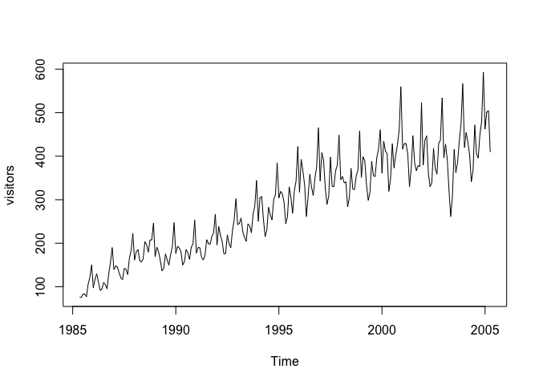
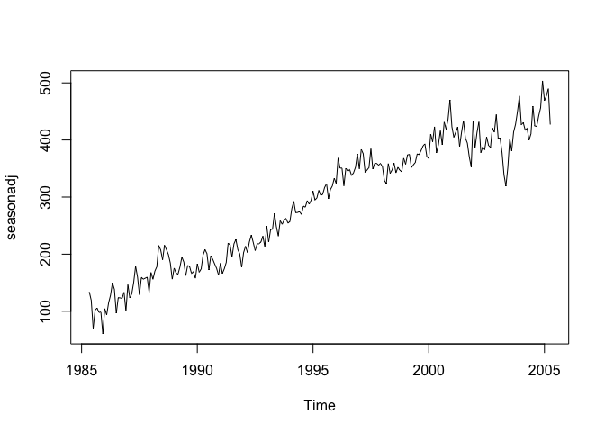
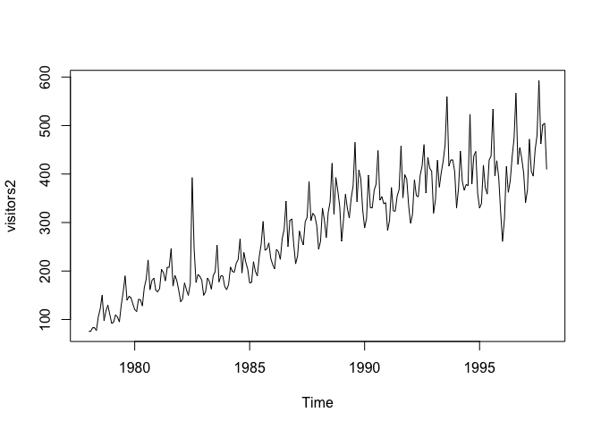
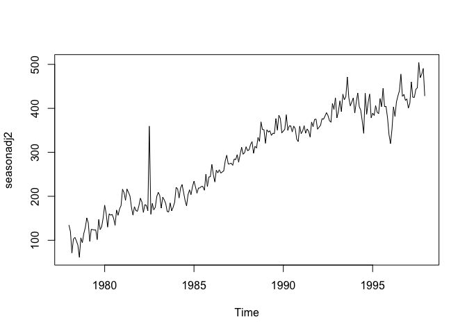
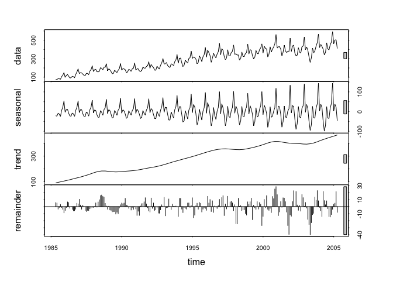
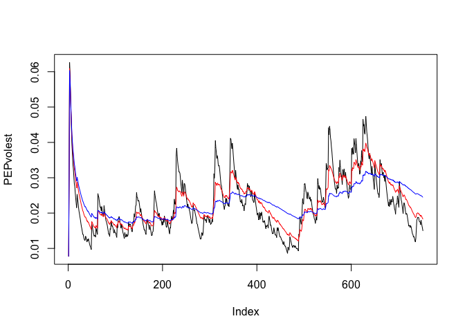

Part 1
------

the goal for the first portion of the assignment is to analyze and
interpret time series data. we were assigned the visitors portion of the
provided dataset.

    library(fpp)

    ## Loading required package: forecast

    ## Warning: package 'forecast' was built under R version 3.2.5

    ## Loading required package: zoo

    ## Warning: package 'zoo' was built under R version 3.2.5

    ## 
    ## Attaching package: 'zoo'

    ## The following objects are masked from 'package:base':
    ## 
    ##     as.Date, as.Date.numeric

    ## Loading required package: timeDate

    ## This is forecast 7.1

    ## Loading required package: fma

    ## Warning: package 'fma' was built under R version 3.2.5

    ## Loading required package: tseries

    ## Warning: package 'tseries' was built under R version 3.2.5

    ## Loading required package: expsmooth

    ## Loading required package: lmtest

    data(books)
    data(ukcars)
    data(visitors)
    plot(books, type="l")

<!-- -->

    plot(visitors, type="l")

<!-- -->

    fitd <- decompose(visitors)
    plot(fitd)

<!-- -->

    seasonadj <- seasadj(fitd)
    plot(seasonadj, type="l")

<!-- -->

    visitors2 <- ts(c(visitors[1:54], visitors[55]+200, visitors[56:240]),start=c(1978,1),frequency = 12)
    plot(visitors2, type="l")

<!-- -->

    fitd2 <- decompose(visitors2)
    seasonadj2 <- seasadj(fitd2)
    plot(seasonadj2, type="l")

<!-- -->

    fitvisitors <- stl(visitors, s.window = 5)
    plot(fitvisitors)

<!-- -->

    plot(visitors)
    lines(fitvisitors$time.series[,2],col="red",ylad="Trend")

    ## Warning in plot.xy(xy.coords(x, y), type = type, ...): "ylad" is not a
    ## graphical parameter

<!-- -->

Part 2
------

We were each assigned stocks and asked to calculated the log return and
measure volatility. I got PSXP, which stands for Phillips 66 Partners,
which is an Oil company

First we grab the data from yahoo

    library(tseries)
    PEPdata <- get.hist.quote('psxp',quote="Close")

    ## time series starts 2013-07-23
    ## time series ends   2016-07-15

    length(PEPdata)

    ## [1] 752

Show the length of the dataset

Now we take the log of the dataset to get the log returns

    PEPret <- log(lag(PEPdata))-log(PEPdata)
    PEPvol <- sd(PEPret) * sqrt(250) * 100
    PEPvol 

    ## [1] 37.37273

And now we calculate the non continuous volatility shown above. Did not
print out the table because it was very long.

Below is a loop that creates a continuous lookback windown for the
volatility measurement

    PEPVol <- function(d, logrets){ 
      var=0 
      lam= 0 
      varlist <- c() 
      for(r in logrets){
        lam = lam*(1 - 1/d) + 1
        var = (1-1/lam)*var + (1/lam)*r^2
        varlist <- c(varlist,var)} 
      sqrt(varlist)}

Weight as 10% 30% and 100%

    PEPvolest <- PEPVol(10,PEPret)
    PEPvolest2 <- PEPVol(30,PEPret)
    PEPvolest3 <- PEPVol(100,PEPret)

    plot(PEPvolest, type="l")
    lines(PEPvolest2, type="l", col="red")
    lines(PEPvolest3, type="l", col="blue")

<!-- -->
Plotted all together

    plot(PEPvolest, type="l")
    lines(PEPvolest2, type="l", col="red")
    lines(PEPvolest3, type="l", col="blue")

<!-- -->

Note that the `echo = FALSE` parameter was added to the code chunk to
prevent printing of the R code that generated the plot.
